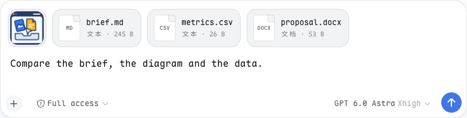
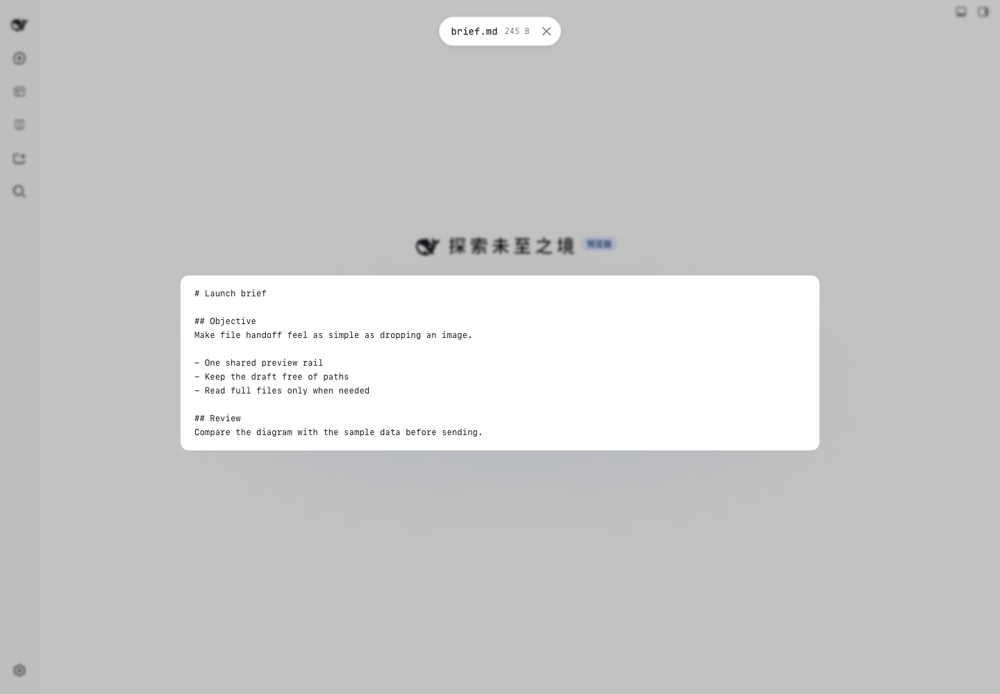

# DSH Drop

> **English** · [中文](README.zh.md)

Drag or paste files into **DeepSeek Harness Web**. Images and files share one preview rail; your draft stays clean. File paths are appended only when you send.

 

## Install

Requires DSH Web from the **0.1.1** train or later (verified against 0.1.1-rc.2, 0.1.2-rc.1, 0.1.2-alpha.5, 0.1.3-alpha.2, 0.1.5-rc.1, 0.1.5-rc.2, 0.1.5-alpha.1 and 0.1.5-alpha.2), pnpm on PATH and an even Node major supported by DSH (CI: 22.19 / 24). Install the prebuilt release, then **restart the profile**:

~~~sh
dsh plugin --profile web add https://github.com/Crosery/dsh-drop/releases/latest/download/dsh-drop.tgz
~~~

The tarball includes both compiled halves, so installation does not run a plugin build. For a pinned install, replace latest/download with download/v0.1.3. The repository also ships the built halves, so `dsh plugin --profile web add github:crosery/dsh-drop` installs with no build approval; prefer the tag-pinned tarball for reproducibility. Do not install a second copy if your local patch already mounts @crosery/dsh-drop.

~~~sh
dsh plugin --profile web remove @crosery/dsh-drop
~~~

Restart after removal too. [Source builds and release procedure](docs/releasing.md).

## What happens to a file?

| Input | Delivery | Preview |
| --- | --- | --- |
| PNG / JPEG / WebP / GIF | Native image attachment; existing model, size and count validation | Thumbnail and image lightbox |
| Other images | File reference | Image element, if the browser supports it |
| Video / audio | File reference | Native browser playback, codec-dependent |
| PDF | File reference | Browser PDF viewer, when available |
| Markdown / code / logs / CSV / HTML | File reference | Escaped text, first 64 KiB; HTML is not executed |
| Office / iWork / archives / unknown files | File reference | Filename, size and format badge; no in-page document renderer |
| Folders | Skipped with a notice | No recursive upload |

A non-image file becomes an **@path**, not a new model content block. The model must explicitly use a file tool to read it; a large log costs only a path until then. This plugin adds no model tool. It complements [DSH Viewer](https://github.com/Crosery/dsh-viewer), which displays files from the model back to you.

1. Drop or paste files into the page with a session open. A mixed batch keeps images on the native image path.
2. Inspect the shared rail. Click a card to preview; remove individual entries without changing your words.
3. Type your request and send. The model receives your words first, followed by file references. **File-only messages can be sent with Enter**; the native send button remains disabled without text or native images.

## Original path first, copy otherwise

A browser File does not expose its OS path. If the transfer also carries a local file:// hint, the Host compares size and modification time (2-second tolerance) and reuses a matching regular file. Unrepresentable reference paths fall back to staging. Metadata matching is a heuristic, not byte identity or a permission check.

Otherwise bytes stream into **$DSH_HOME/drops/YYYY-MM-DD/**. Completed copies publish without overwriting another drop, including concurrent uploads. Edits to a copied file do not update the original. For a dependable workspace reference, use the composer's @ completion. A remote agent must be able to read the Host path; this plugin does not synchronize files to remote workspaces.

## Configuration

Namespace **crosery-drop** in $DSH_HOME/settings.yaml; settings changes apply live.

| Key | Default | Meaning |
| --- | ---: | --- |
| maxBytes | 536870912 (512 MiB) | Maximum bytes per staged file; must be positive. |
| keepDays | 30 | Retention by date directory; 0 disables pruning. |

Cleanup runs at activation and when retention changes. It deletes expired date-named directories, including manually added contents inside them; other names and loose files are untouched. Removing a card does **not** delete the staged copy.

## Important limits

- **Unsent non-image entries are page-local. Refresh or plugin unload loses the pending references and previews.** Drop again before sending. Copies may still exist on disk; that does not restore the pending list.
- There is no upload progress or aggregate disk quota. Wait for the card to appear before sending; large files can take time. Partial batch failures currently log to the console; a wholly failed batch shows a notice.
- With pending files, Enter is intercepted as send (Shift+Enter and IME are excluded). Cmd/Ctrl+Enter uses ordinary delivery rather than steer; custom submit-key preferences are not honored in this path. Without pending files the native gestures are untouched.
- If submission fails, references remain in the rewritten draft for retry rather than returning to the rail. Slash-command and queued-delivery interactions inherit the composer and need care; the plugin cannot create a generic file content block.
- Preview objects are retained until plugin unload. Re-dropping a modified in-place path can reuse an older preview; the model reads the actual file. Browser media/HEIC/PDF support varies.
- The single attachment slot is replaced, not added alongside other replacements. Another plugin taking that same priority can conflict. Unloading restores the shipped rail.

## Security

No third-party upload service, analytics, automatic execution or archive extraction. Staging is a Host write endpoint: names are reduced to one segment, size is bounded, simple cross-site POSTs are refused, and no CORS access is granted. **This is not authentication.** Keep DSH loopback-only or behind authenticated access; do not expose its host authority to untrusted users. Same-origin plugins can act with the page's authority.

SVG remains inside an image element, HTML is escaped text, and PDF blobs are forced to application/pdf. Preview UI does not offer top-level blob navigation. The default retention is not secure erasure. See [development and security boundaries](docs/development.md).

## Develop

~~~sh
npm ci
npm run typecheck
npm test
npm run build
npm run check
npm run check:dist
~~~

This repository is self-contained and uses public pinned dependencies, not a sibling checkout. [AGENTS.md](AGENTS.md) routes contributors to the [paired development, PR, release and compatibility docs](docs/README.md). Four workflows cover CI, deterministic PR review, gated Release and scheduled upstream drift detection.

## License

[MIT](LICENSE), including the original project icon and synthetic demo assets. Source originated in Crosery's plugin workspace; this is its standalone distribution repository.
