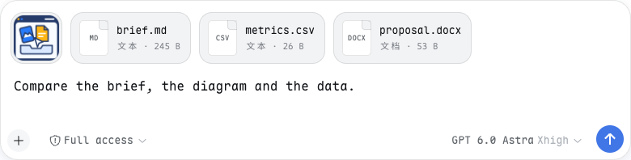
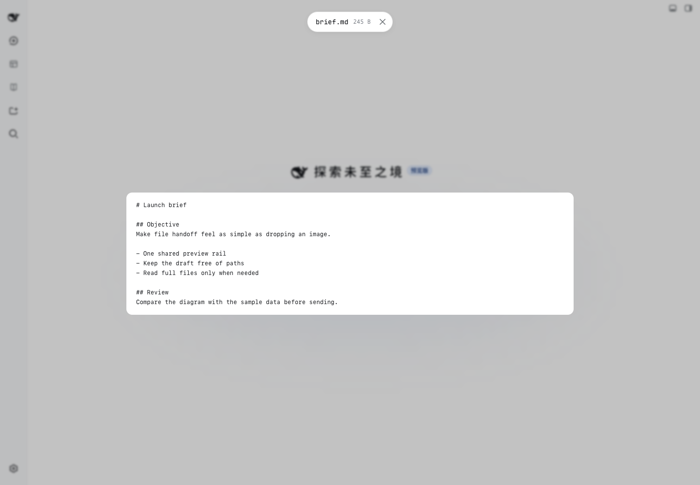

# DSH Drop

> [English](README.md) · **中文**

把文件拖进或粘贴进 **DeepSeek Harness**——Web 版和桌面应用都支持。图片和文件共用一条预览栏，草稿只保留你打的字；**发送时才追加文件路径**。

 

## 安装

| 场景 | 支持范围 | 验证方式 |
| --- | --- | --- |
| **Web**（`dsh --profile web`） | **0.0.1-rc.5 至 0.1.7-rc.2**——每个能装上的已发布版本 | peer 范围接纳每个已发布版本。CI 用 `dsh plugin add` 把打包后的插件装进其中每一个并运行：激活、路由应答、浏览器半边被服务端提供并在无头 Chrome 中运行，往输入框拖入的文件必须出现在预览栏里；同时用该版本自己的包做类型检查和测试。更早的构建按发布时的依赖，还在 0.0.1-rc.5、0.1.0-rc.2 和 0.1.0-rc.6 上用浏览器手动实测了拖入图片、PDF、文本文件和文件夹，以及预览、移除和发送。0.0.1-rc.1 与 rc.2 同样被接纳，但这两个版本的 `@deepseek-ai/dsh` 本身装不上：它依赖的 `@deepseek-ai/dsh-agent-tool-mode` 从未在 npm 上出现过。 |
| **桌面应用** | **0.1.7-rc.2** | 在应用自带的运行时（即其更新 feed 发布的版本）上跑同样的启动冒烟。应用窗口和原生拖放不在 CI 覆盖范围内。 |

0.1.0-rc.8 之前的输入框没有附件槽：预览栏是输入框卡片正上方单独的一行，承载文件和文件夹；拖入或粘贴的图片进入卡片里输入框自己的图片条，受输入框自己的限额约束。

从 0.1.7 起，DSH 会拒绝安装、并在启动时跳过 peer 范围不包含它的插件——0.2.0 之前的版本在 0.1.7 上无法加载。更新的 harness 只有经 CI 验证后才会纳入；逐版本证据见[上游兼容性](docs/harness-compatibility.zh.md)。

**桌面应用：** 打开 **插件 → 添加插件**，粘贴发布地址后重启应用：

~~~text
https://github.com/Crosery/dsh-drop/releases/latest/download/dsh-drop.tgz
~~~

`dsh plugin` 命令行拒绝操作桌面 profile，所以只能通过插件页安装；升级已安装的插件同样需要重启。

**Web：** PATH 上有 pnpm，以及 DSH 支持的偶数 Node 主版本（CI：22.19 / 24）。安装预构建包，然后**重启 profile**：

~~~sh
dsh plugin --profile web add https://github.com/Crosery/dsh-drop/releases/latest/download/dsh-drop.tgz
~~~

tarball 已包含双半边产物，安装不用运行插件构建。固定版本时将 latest/download 替换为 download/v0.3.0。仓库同时提交了构建产物，因此 `dsh plugin --profile web add github:crosery/dsh-drop` 不需要任何构建授权即可安装；需要可复现时优先用打 tag 的 tarball。若本地 patch 已挂载 @crosery/dsh-drop，勿重复安装。

~~~sh
dsh plugin --profile web remove @crosery/dsh-drop
~~~

移除后同样需要重启。[源码安装与发版流程](docs/releasing.zh.md)。

## 文件如何抵达模型

| 文件 | 发送方式 | 预览 |
| --- | --- | --- |
| PNG / JPEG / WebP / GIF | 出厂图片附件，沿用模型能力、大小、数量校验 | 缩略图和图片灯箱 |
| 通过输入框自带 **+** 选择的文件 | 出厂文件附件（0.1.3 起），由 DSH 上传 | 卡片显示上传进度、失败与重试 |
| 其他图片 | 文件引用 | 浏览器支持时显示图片 |
| 视频 / 音频 | 文件引用 | 原生播放控件，取决于编解码器 |
| PDF | 文件引用 | 浏览器有 PDF 阅读器时可预览 |
| Markdown / 代码 / 日志 / CSV / HTML | 文件引用 | 转义文本，前 64 KiB；不执行 HTML |
| Office / iWork / 压缩包 / 未知类型 | 文件引用 | 文件名、大小、格式徽标；没有文档渲染器 |
| 文件夹 | 一个文件夹引用 `@/path/to/folder/`；已知路径时直接引用原文件夹，否则连同目录结构复制 | 文件夹卡片显示文件数、大小和跳过的条目；列表以纯文本显示前 200 个相对路径 |

非图片文件成为 **@路径**，不是新的模型内容块。模型必须显式调用文件工具才看得到内容，因此大日志在被读取前只花一个路径的 token。文件夹成为一条带结尾斜杠的 **@路径/**——0.1.5 起模型的引用提示词说明这样的路径要列目录；0.1.1 把所有 `@` 都当文件，模型读取时才会发现是目录。文件夹里的图片随文件夹一起走，不会变成图片附件。本插件不新增模型工具；它与 [DSH Viewer](https://github.com/Crosery/dsh-viewer) 互补，后者负责模型向你展示文件。

1. 打开一个会话，把文件拖入或粘贴进页面。落在哪个输入框上就进哪个输入框，落在别处则进当前对话的输入框；暂不接收文件的输入框（子智能体的、正在发送的）会直接提示原因。混合批次中的图片仍走出厂通道。
2. 在同一条栏中检查卡片：路径就绪前卡片显示「准备中…」；点击预览，逐个移除不会改变你打的字。同一个文件拖两次只会加一次。
3. 输入要求，按 Enter 或点发送按钮。模型先收到你的话，再收到文件引用。**只发文件时可以按 Enter，也可以直接点灰色的发送按钮。**

## 优先原文件，否则暂存

**桌面应用：** 应用会把每个拖入文件的真实路径告诉页面，引用直接指向原文件——不复制，之后的修改在模型读取时即可见。

**Web：** 浏览器 File 不提供 OS 路径。拖拽若额外携带本地 file:// 提示，Host 比对文件大小和修改时间（允许 2 秒误差），匹配普通文件则引用原路径。元数据匹配只是启发式，不代表字节完全一致，也不是权限检查。路径中含双引号或控制字符时无法写成引用，退回暂存。

否则字节流入 **$DSH_HOME/drops/YYYY-MM-DD/**。完整副本以不覆盖的方式发布，并发同名上传也不会互相改写。编辑副本不会回写原文件；想可靠引用工作区文件，用输入框 @ 补全。远程 agent 必须能读取 Host 路径；本插件不自动同步远程工作区。

## 文件夹

拖入的文件夹是一张卡片，发送时是一条引用。它和文件一样有两条路抵达模型：

- **原位引用。** 桌面应用里页面能拿到文件夹的真实路径，直接引用原文件夹：不复制，模型看到的是完整文件夹，包括 `.git`。Web 上若拖拽带有该文件夹的本地 `file://` 提示，Host 会用文件夹里前八个文件（相对路径、大小、修改时间；不足八个就要全部描述）核对，核对通过才原位引用。
- **复制。** 否则页面遍历文件夹，按原有目录结构上传到 **$DSH_HOME/drops/YYYY-MM-DD/<名称>/**。所有文件到齐后副本才以该名称出现；重名时加后缀（`proj-2`）。忽略列表中的名称（`.git`、`node_modules`、`.DS_Store`、`Thumbs.db`、`__MACOSX`、`.svn`、`.hg`）会跳过，它们和无法读取的文件都会在卡片上计数。空的子文件夹不会重建。

超过复制上限的文件夹——文件数、总大小、单个文件超过 `maxBytes` 或嵌套层级——会**整个拒绝并提示是哪一项上限**，绝不只发一部分。文件夹还在读取或上传时，卡片显示进度，此时发送会被拦下并提示「等待上传完成」。移除卡片会取消上传，Host 删除已到达的部分。混合拖入时每一项各走各的路：一个被拒绝的文件夹不影响同批的文件和图片。

## 配置

**0.0.1-rc.5–0.1.6**：$DSH_HOME/settings.yaml 中命名空间 **crosery-drop**，修改即时生效。

**0.1.7**：settings.yaml 已取消。请在 profile 的 `cordis.patch.yml` 里给插件条目（id `drop`）写配置（需重写整个 `config` 块——patch 会替换该行的配置）。0.1.7 的一次性导入**不会**迁移 `crosery-drop` 段：它按段名寻找同名条目，而本条目叫 `drop`；旧值留在 `settings.yaml.imported` 里。0.1.7 的设置页不会为这些字段生成表单。

| 键 | 默认值 | 含义 |
| --- | ---: | --- |
| maxBytes | 536870912（512 MiB） | 每个暂存文件的字节上限，复制文件夹时对其中每个文件同样适用；必须大于零。 |
| keepDays | 30 | 按日期目录保留的天数，0 关闭清理。 |
| folderMaxFiles | 2000 | 复制的文件夹最多包含的文件数。 |
| folderMaxBytes | 536870912（512 MiB） | 复制的文件夹总字节上限。 |
| folderMaxDepth | 32 | 复制的文件夹在其下方最多嵌套的层数。 |
| folderIgnore | `.git`、`node_modules`、`.DS_Store`、`Thumbs.db`、`__MACOSX`、`.svn`、`.hg` | 复制文件夹时跳过并计数的名称，与每个文件或文件夹名精确匹配。 |

文件夹上限只作用于复制；原位引用的文件夹没有大小限制。

启动及保留期改变时清理过期日期目录，**目录内手工放入的东西也会删除**；其他名称的目录和零散文件不动。启动时还会删除日期目录里中断的上传留下的东西——30 分钟内没有写入的隐藏 `.batch-*` 文件夹和 `.incoming-*` 半截文件——`keepDays` 为 0 时也一样。移除卡片**不会**删除副本。

## 重要限制

- **未发送的非图片清单只存在页面内。刷新或卸载会丢失待发引用和预览，发送前需重新拖入。** 磁盘上有副本不代表待发清单恢复了。
- 单个文件的复制没有字节级进度（文件夹显示已完成/总文件数），跨多次拖入也没有总磁盘配额。卡片仍在准备或上传时发送会被拦下并提示；未能暂存的文件会按数量提示。
- **复制文件夹会复制忽略列表以外的一切，包括 `.env` 这类机密文件**，与单独拖入该文件相同。文件夹内的符号链接按浏览器的读取方式处理；Host 原位统计文件夹时从不跟随链接。
- 粘贴文件夹只是尽力而为：浏览器很少把文件夹放进剪贴板。
- 在 0.1.2 起的输入框上，引用在你发送的那一刻追加到消息末尾，再由输入框自己的 Enter 或发送按钮投递——Cmd/Ctrl+Enter 的 steer/排队、上传检查和斜杠命令都照常生效。若输入框拒绝发送（例如它自己的上传还没完成），追加的引用会被撤回，文件继续留在栏中。Shift+Enter、输入法组字、高亮中的补全菜单都不会被当作发送；停止按钮永远不会带走文件。Alt+Enter、AltGr+Enter 和 Ctrl+Cmd+Enter 在 0.1.7-rc.1 及之前的输入框上会发送，同样带上引用；0.1.7-rc.2 忽略这些按键，引用会被撤回，且有暂存文件时不会插入换行。textarea 输入框（0.1.1 及更早）仍由插件改写草稿并自行提交；补全菜单有高亮项时，Enter 仍是选中它。
- 已发出的消息若之后失败，输入框会把带引用的文字恢复到草稿供重试，引用不会回到附件栏。本插件无法新增通用文件内容块。
- 附件留在栏中时预览字节保存在内存里，发送或移除后即释放。预览显示的是拖入时的字节，模型读取的是实际文件。媒体、HEIC、PDF 支持因浏览器而异。
- 0.1.0-rc.8 之前，预览栏和输入框的图片条是两行：图片留在输入框自己的图片条里，由输入框绘制和移除；卡片上方的预览栏承载其余一切。
- 接管 single 附件席位而非加一条并列栏；其他插件若占用相同优先级可能冲突。卸载后恢复出厂栏。

## 安全

没有第三方上传服务、分析统计、自动执行或解压。暂存是 Host 写端点：文件名归约成单段（Windows Host 上遵循 Windows 命名规则）、限制大小、拒绝简单跨站 POST、不授予 CORS。复制文件夹时，Host 会重新清洗文件夹名和每个相对路径（不允许 `.` 或 `..` 段、去掉控制字符、在 Windows Host 上替换 Windows 保留字符和保留名、限制字节长度），只写入该批次自己的私有目录，且从不覆盖已有路径。从 **0.1.2** 起三条路由还要求 harness 自身的登录鉴权（其 connection 检查），没有登录 cookie 的其他本机进程会被拒绝——CI 在每个做启动冒烟的序列上都会检查这一点。**0.1.2 之前（0.0.1-rc.5 至 0.1.1）这些路由没有自己的鉴权**：保持 DSH 仅本机可访问或置于认证之后，不向不受信任用户暴露宿主权限。同源插件拥有页面权限。

SVG 留在图片元素，HTML 只展示转义源码，PDF blob 强制 application/pdf；预览不提供顶层 blob 导航。默认保留期清理不等于安全擦除。参见[开发与安全边界](docs/development.zh.md)。

## 开发

~~~sh
npm ci
npm run typecheck
npm test
npm run check:dist
npm run build
npm run check
~~~

仓库自足，依赖公开 pin 版本，不要求兄弟 checkout。[AGENTS.md](AGENTS.md) 路由到[双语开发、PR、发版与兼容规范](docs/README.zh.md)。CI 在 Node 22.19 和 24 上按此顺序跑以上门禁——`check:dist` 在 `npm run build` 重写 `lib/` 之前用临时构建比对已提交的产物，构建后树必须保持不变——另跑两个 harness 组合——固定的 0.1.7-rc.2 开发序列和 0.1.1-rc.2 地板——每格都做类型检查、测试、peer 准入和打包插件的启动冒烟；第三格跟随桌面应用的版本。Harness compatibility 工作流每天对桌面应用 feed 与 npm `latest` / `next` / `alpha` 运行，每周扫描全部已发布的 harness 版本——除类型检查、测试和准入外，每个版本都装入打包后的插件并启动——并在 macOS 上对桌面应用本体运行。发版必须先让它要发布的那个 tarball 通过同一道门禁。

## 许可

[MIT](LICENSE)，包括原创图标和合成演示素材。源码起源于 Crosery 的插件工作区，本仓库是独立分发版本。
